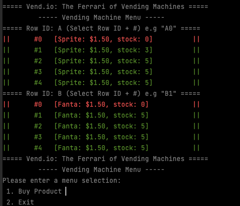
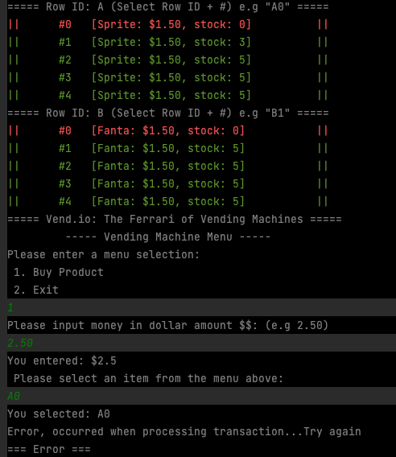

# Vending Machine

#### This program utilizes OOP principles, MVC design pattern, unit testing & more

-----
**Models (POJOs)**:
* Row (for displaying items in columns)
    * **Name** (The associated row letter for selection)
    * **List\<Item> rowItems** (the datastructure to store and select an individual item based on index)
    * **Coin (Enum)** to provide change during the transaction process 
* Item (single products)
At the start of the application the user is prompted with a Vending Machine menu via CLI / Terminal



Products are loading from the "dao" and currently, a text file works our repository/database. We scan the file using Java's conventional Scanner/BufferedReader
`scanner = new Scanner(new BufferedReader(new FileReader(INVENTORY_FILE)));`

  * **Unmarshalling**: A string representation of the data is converted to a Java object using setters/constructor
  ```
  private Item unmarshallItem(String itemAsText) {
        String[] itemTokens = itemAsText.split(DELIMITER);
        String itemName = itemTokens[0];
        String itemCost = itemTokens[1];
        String itemStock = itemTokens[2];
        return new Item(itemName, itemCost, itemStock);
    }
  ```

  * **Marshalling**: Object data is converted into a string representation

```
Sprite::1.50::5
Fanta::1.50::0
```


**Products that are sold out are intuitively printed in red, while available products are displayed in green**


After prompted the user is able to select from two options:
**1. Buy Project**
**2. Exit**


**Buying a Product**: 
* The Vending Machine works by processing a String that contains a **letter** and **number** in order
* Validation / exception handling is used to ensure a valid selection along with making sure only Items in stock are selected

**Example of an invalid selection due to out of stock**



----
This project also utilizes:
* Dependency Injection
* Exception Handling
* Enums
* Bigdecimals
* Lambda Expressions & Streams


